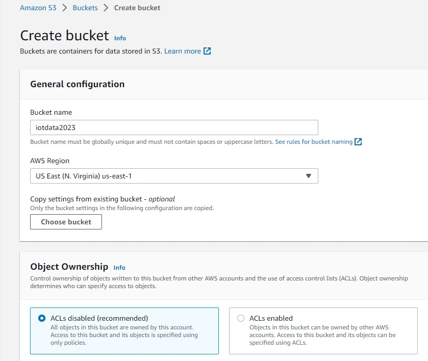
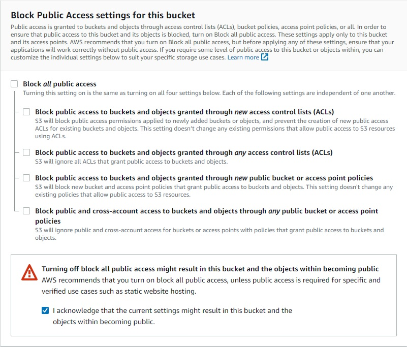
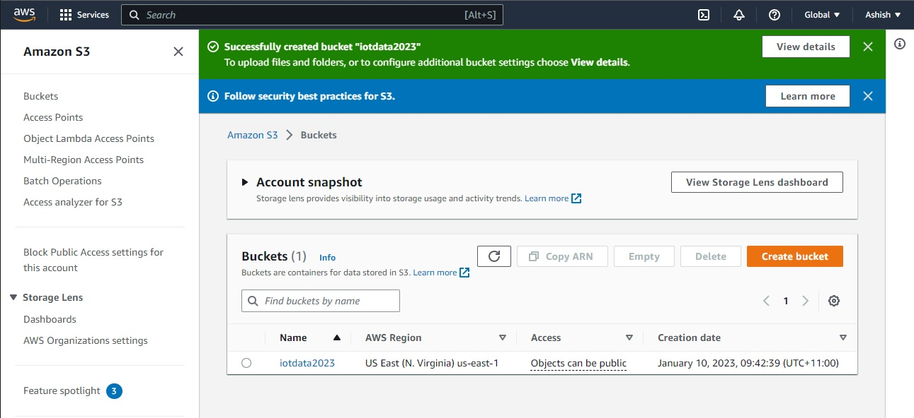
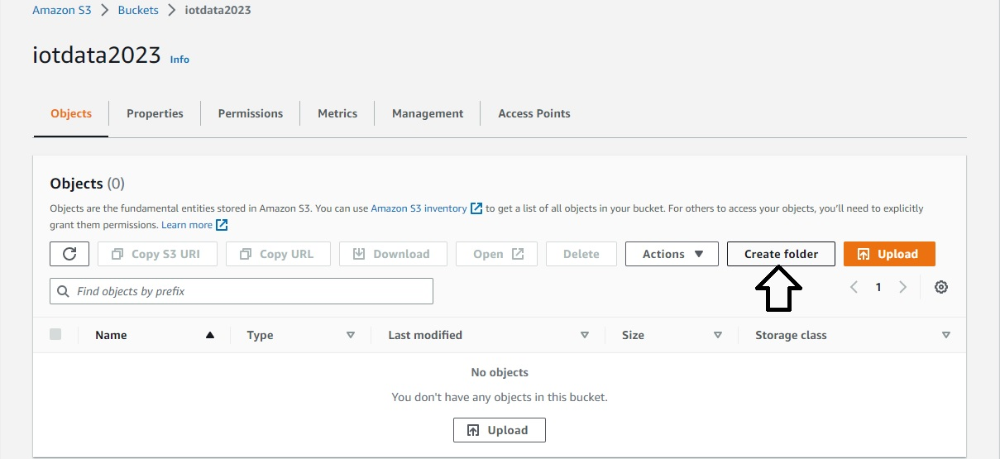
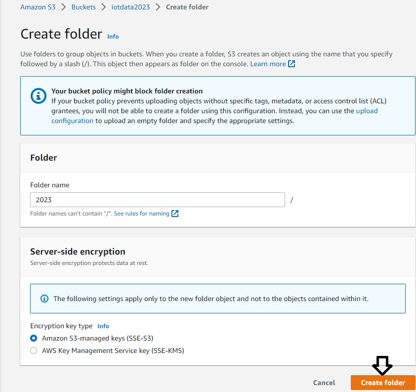
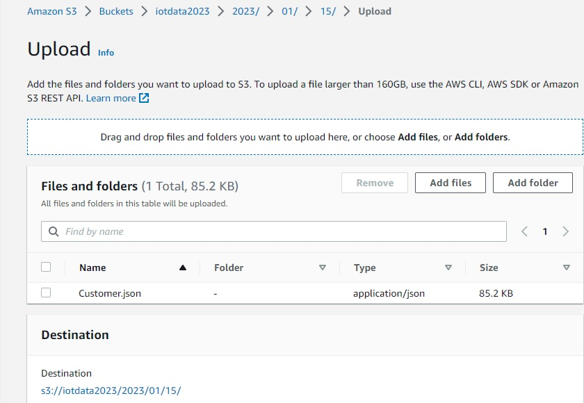

# Create S3 bucket in AWS account and upload data

Looking back at our architecture diagram, we see that the starting point is the S3 bucket.Therefore, let us start our implementation by creating an S3 bucket in AWS Cloud and uploading data in there. For this, you will need an S3 account. If you don't have one, please go ahead and create a free Amazon web service account.

Here are the steps to follow for creating our bucket in AWS Portal:

* Create a bucket by providing a name of your choice. In my case, I am using the name "iotdata2023". I keep everything else as default.

* Let us allow the public access to this bucket and also acknowledge the same. Click on "Create" button to create this bucket now.

* Ensure that the bucket gets created successfully.

* Now, let us put some sample data inside this bucket. But wait...what we would like to do is create a folder for year, month and day first, as we know that this data will be sent on a daily basis. So let's create a folder for the year 2023. Just click on "Create Folder" button.

* Now, let us provide "2023" as the folder name. Keep all other default settings. Click the button "Create Folder".

* Now, create a folder called "01" for the month of January inside the "2023" folder. 
* Next, create a folder called "15" to represent 15th January inside the "01" folder. 
* Now let's upload our data inside this "15" folder. Select the file "Customer.json" from the resources folder and upload it here.

That's the end of this lab. Let's see how to create the landing folder in Azure Storage now.

[Back](../readme.md)  [Next](../Lab-02/readme.md)