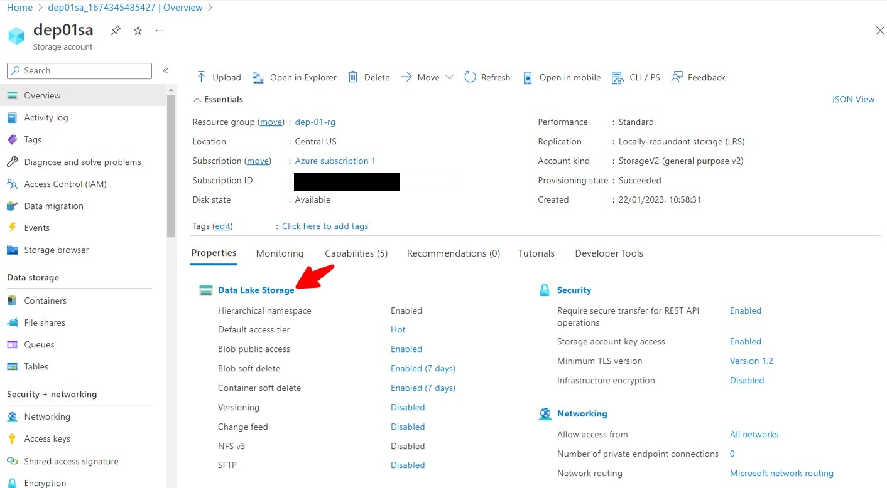

# Create S3 bucket in AWS account and upload data

Welcome to the session in this session, we will going to create the Azure data storage account, which

is our landing folder.

So if you remember our architecture diagram, you can see that once our file moved from the A.W. as

a twist to it, it need to be placed within the landing folder in that storage account.

So for that, we need to create the storage account.

So let's go to the Azure portal and create the landing folder.

So I'm on my Azure portal.

So in this Azure portal, you go and select Insert Storage account.

I have Kopaloff already created storage accounts.

I can see all of them.

It is not mandatory to create a new storage account if you already have an storage account and if you

want to use that self, you can use that also.

But I'm showing it for people who does not have any storage account, so let's see how we can create

that storage account.

To be clear, this will take you to their storage can be blurred

again.

Like for any resource, I will always ask you the subscription in which you want to create.

So you can select the subscription.

It will ask you to create the household group, so I'm selecting the Project one, which is the same

resource group which we have created used for creating the ETF account.

Then it asked me the storage account name, so I'm just giving a storage project one you can give any

name as per your convenience because if I take up this name, you probably probably will not be able

to give the same name because it goes to his account.

Name need to be unique across the aisle as your client.

You can select the performance as the standard itself.

Read an entry level if you want to load it down just for a testing purpose.

You can use local remained or you can keep the then it's up to you.

Move to the next.

It runs here.

If you go, scroll down a little bit here, you will enable critical namespace.

So if you select this, then this is a storage account will get converted into a dealer's Gen2 account.

So just select that list you can keep as it is.

You can keep all this default and you can click on next.

Again, you can click next.

Keeping everything as default again next.

And finally, you click on Review Plus Create.

This will create your first Azure account and Saudi agent storage account.

It will take some time, maybe a few seconds, so I will fast forward it now you can see that our strategic

on has been created.

So let's click on good resource.

This will take me to the storage account.

Now here you can see data storage.

So click on that.

Let's create the container.

So click on container.

I'm giving them as input and concrete, so this will create a container input inside my storage account.

Now here inside this storage account container, let's create a one folder that is our landing.

So this is the folder where I want to see all my files get drubbed from E.W..

So this will be our landing folder.

That's all for this session.

We'll see you in the next session.

That's the end of this lab. Let's see how to create the landing folder in Azure Storage now.

[Back](../readme.md)  [Next](../Lab-02/readme.md)