# Create ADLS Storage Account

Welcome to this lab where we will create the Azure data storage account.

Here are the steps to follow for creating Azure Data Lake Storage (ADLS) account in Azure Portal:

* On the Azure portal home page, click on "Create a resource" icon to create a new resource

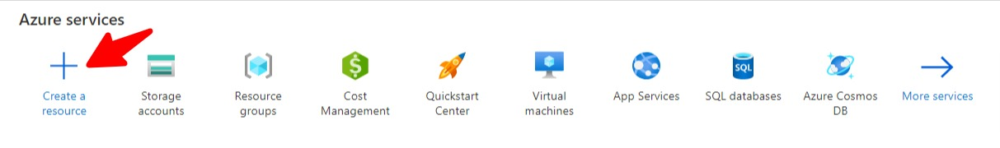

* In the search box for Marketplace, type in "Storage Account" and press Enter

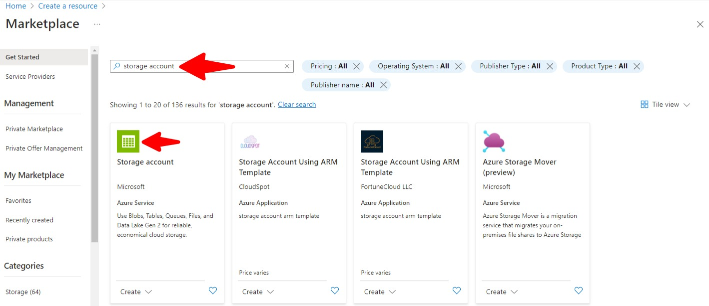

* Click on "Storage Account" and then click on "Create" button

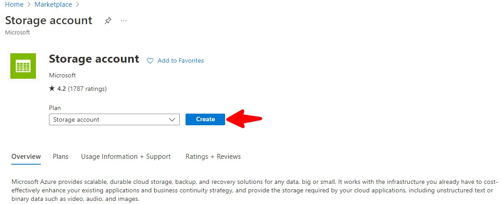

* In the Project Details section, select your Azure subscription 
* Provide a name for Resource Group
* In the instance details section, provide a storage account name 
* Select your region

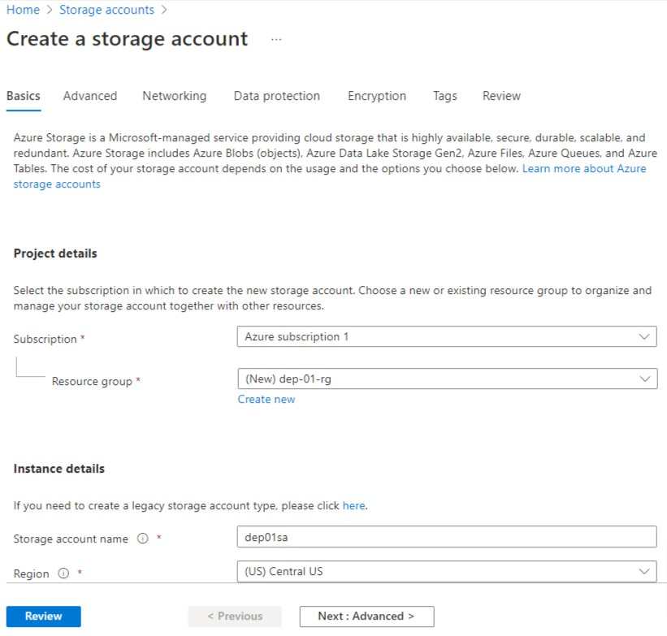

* In the instance details section, select Redundancy for your storage account
* Click on "Next : Advanced" button

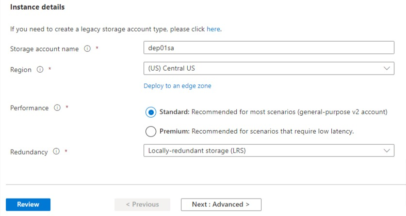

* In the Data Lake Storage Gen2 section in the Advanced tab, check the check box for "Enable Hierarchical Namespace"
* Click on "Next: Networking" button

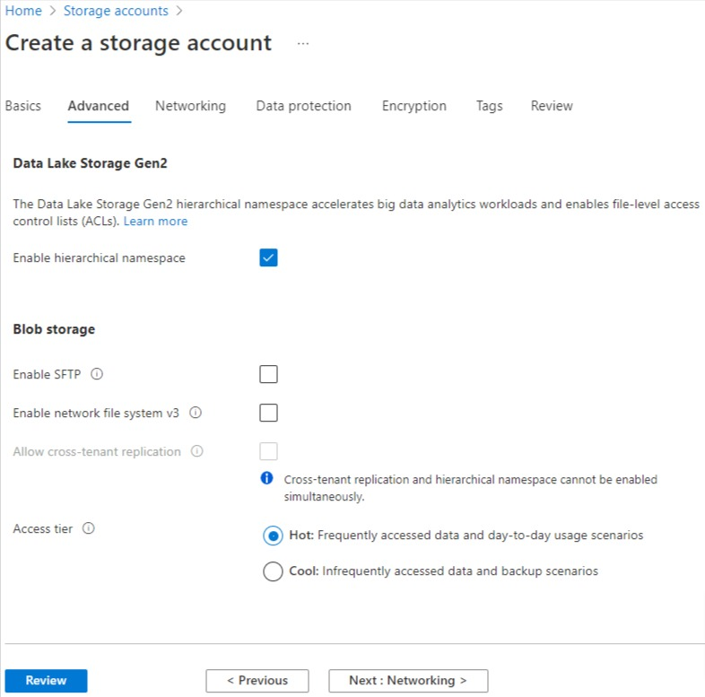

* Keep the default sesstings in Networking, Data Protection, Encyption and Tags tabs
* On the Review tab, review your settings and click "Create" button

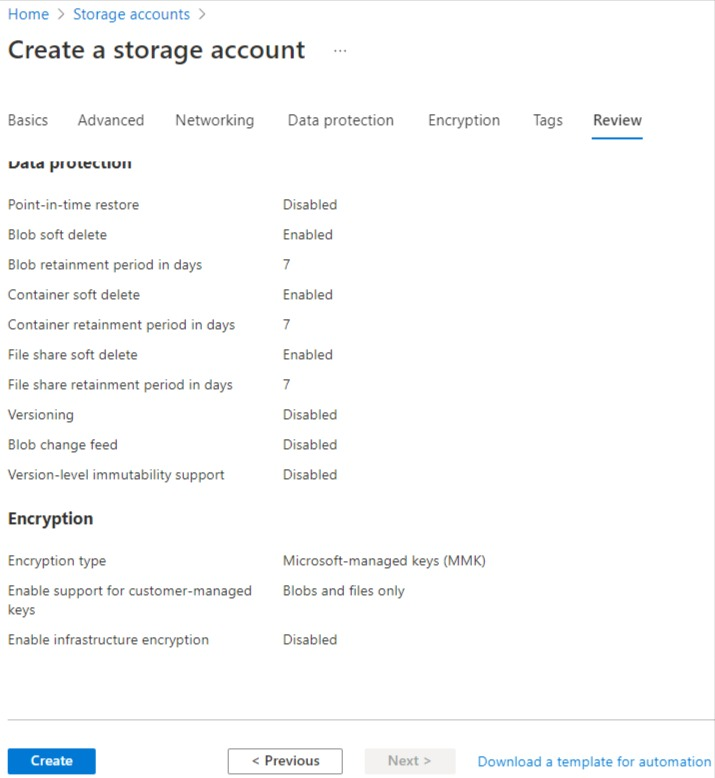

* Wait for a few seconds for the deployment to complete. Ensure that the deployment succeded and the resource was created. 
* Click on the "Go to resource" button

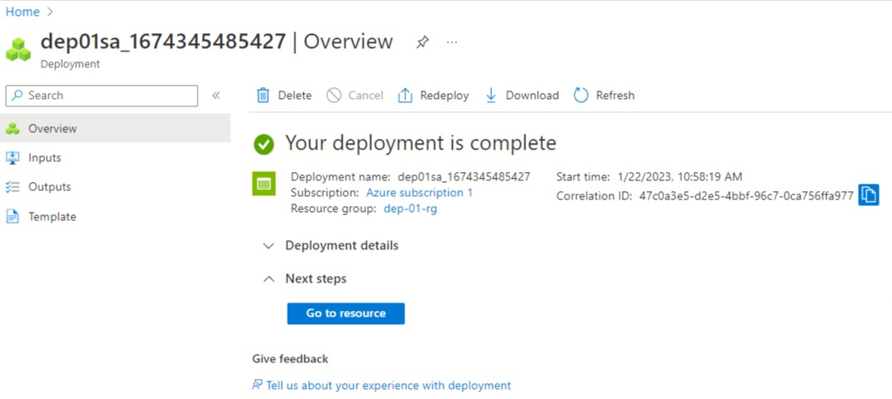

* Click on Data Lake Storage

* Let's create the container now
* Click on container and provide "Input" as name for this container

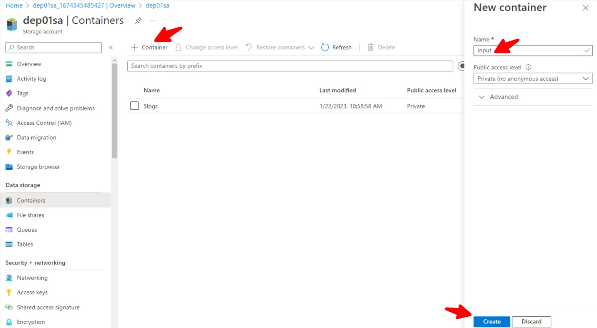

* Inside the container "Input", let us now create a folder by clikcing on "Add a Directory" button and providing "Landing" as the name
* Click on "Save" button

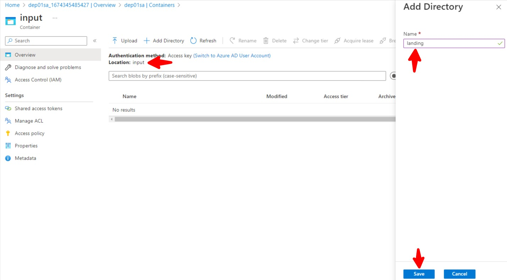

* "Landing" folder is the place where we want to see all our files get dropped from AWS.

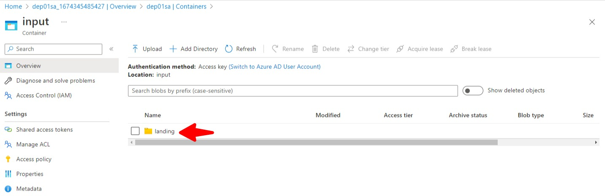

That's the end of this lab. 

[Back](../Lab-01/readme.md)  [Next](../Lab-03/readme.md)