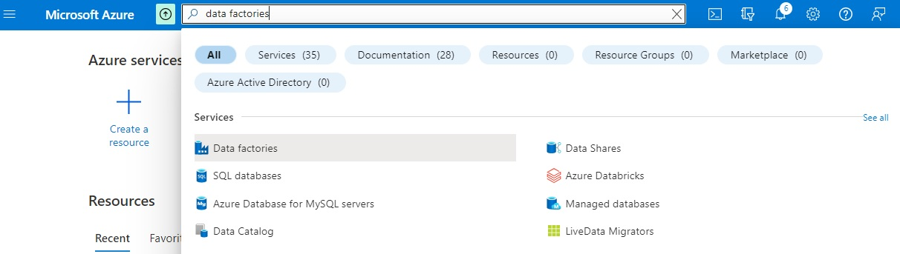

# Create Azure Data Factory account for Data Pipelines

Welcome to this lab where we will create Azure Data Factory account for Data Pipelines. 

As per our architecture diagram, we have already created an AWS bucket and stored our sample file there. Now, we want to move the IoT data from AWS bucket to the Azure cloud. In order to move this data, we need an ADF account. Here are the steps to follow for creating Azure Data Factory account for Data Pipelines in Azure Portal:

* Go to the Azure portal home page

* In the search box, type "Data Factories"

* Click on the "Data Factories" service. This will open up the Data Factories page
* Click on "Create" link to create ADF

* In the Project details section,select your Azure subscripion and provide a name for your ADF
* In the Instance details section, provide a name and select a region for your ADF
* Click "Next: Git Configuration" button

* Select all default values in Git Configuration, Networking, Advanced and Tags tabs

* Click on "create" button in "Review + create" tab

* Ensure that the ADF is created successfully
* Click on the "Go to resource" button

* Click on "Launch Studio" in Azure Data Factory Studio page

That's the end of this lab. 

[Back](../Lab-02/readme.md)  [Next](../Lab-04/readme.md)