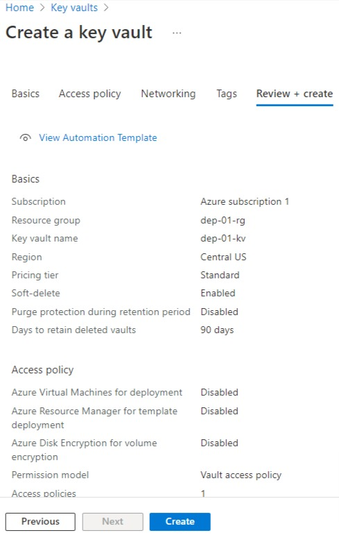

# Create Azure Key Vault

Welcome to this lab where we will create Azure Key Vault. Key Vault is required for managing and storing  credentials and secrets. In our case, in order to connect to the AWS S3 account, we need Access Keys and Access ID. We will store both of these within the key Vault. This is also the industry best practices. Please follow the steps below to create Azure Key Vault.

* Go to the Azure portal home page

* Search for "Key Vault" in the search bar and click on "Key Vaults" in services

* Click on "Create" link to create a new key vault

* In the Project details section of Basic tab, select your Azure subscription and resource group
* In the instance details section, provide a key vault name and select Region and pricing tier
* Click "Next" button

* Keep the default values for the tabs Access Policy, Networking and Tags. Review the details on the "Review + create" tab and click "Create" button

* Ensure that the deployment is complete and key vault resource is created
* Click on "Go to resource" button

* On the left hand menu, click on "Secrets" link. Here, we will store Access Key ID and secret for connecting to AWS S3 bucket

* In a seperate browser window, open your AWS portal and navigate to Identity and Access Management (IAM) page
* Since I created a brand new AWS trial account, I do not see the "Manage access keys" option for root user on this IAM page

* In order to create access keys for root user, click on your account name on top right side in the navigation bar, and then choose "My Security Credentials"

* Scroll down on the page and click on "Create access key" button

* Copy the access key and secret access key and paste it in notepad 

* Back on the browser window where we had created Azure key valut, let's create a new secret. Click on "Generate/Import" link to create a secret 

* Provide name "s3accesskeyid"

* Copy paste the access key ID value from notepatd into textbox for Secret value

* Click on "Create" button

* Click on "Generate/Import" link once again to create a secret 

* Provide name "s3secretkey"

* Copy paste the secret access key value from notepad into textbox for Secret value

* Click on "Create" button

* In order for Azure Data Factory to access these keys that we just created, we need to assign the access policies
* On the key vault page, click on "Access Policies" from the left hand menu

* Click on "Create" link to create a new Access Policy

* For the "Configure from template" drop down, select "Key, Secret and Certificate Management" optionThis will auto populate Key permissions, Secret Permissions and Certificate Permissions check boxes
* Click on "Next" button

* On the Principal tab, provide the Azure Data Factory name that we created in Lab-03
* Click "Next" button

* In the "Review + create" tab, click "Create" button to create this access policy. Once the policy is created, it will show on the Access Policies page.

That's the end of this lab. 

[Back](../Lab-03/readme.md)  [Next](../Lab-05/readme.md)