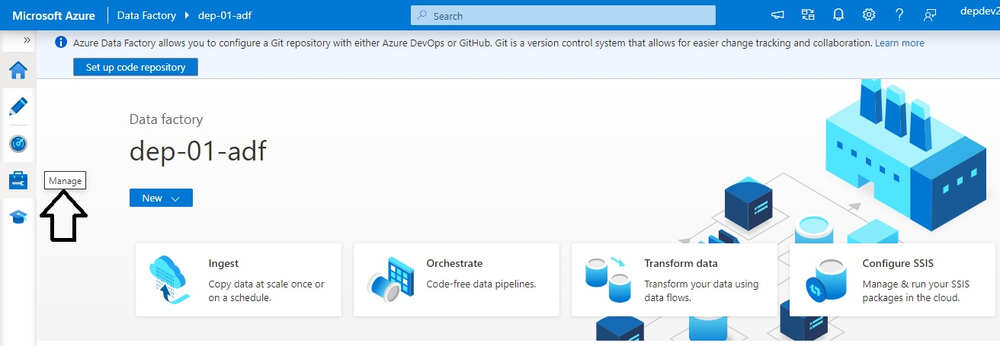
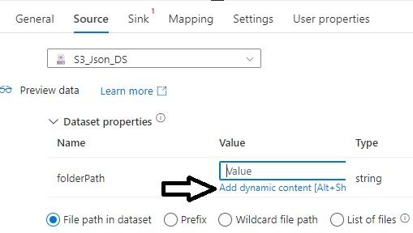

# Create Data Pipeline to move data from AWS S3 storage to landing folder in ADLS. 

Welcome to this lab where we will move data from Amazon S3 storage to the Azure cloud storage.

* Launch the Azure Data Factory Studio in your Azure portal


* Click on Manage tab in Azure Data Factory Studio



* The first task that we will do now is create a linked service that will connect to AWS S3 storage
* Click on "New" link


* Select Amazon S3 and click on "Continue" button


* Provide "S3_LS" name for your linked service 


* In the "Authentication Type" section, we will use our key and secret stored in Azure Key Valut to connect to Amazon S3 

* For Access Key ID, select Azure Key Vault

* In the AKV Linked Service, click on New to create a new linked service to Azure Key Vault


* Keep the default settings

* In the Azure Subscription dropdown, select your appropriate subscription

* In the Azure Key Valut Name dropdown, select the key vault that we created in the previous lab

* Click on "Test Connection" link at bottom right on the page to test this connection

* Click Create button to create this linked service to Azure Key Vault


* Back in the newlinked service windows for AWS S3, select the newly created AKV linked service

* Similarly, for the secret name, select the s3keyaccessid, which is the access key id we created in Azure Key Vault to store the access key

* For the secret access key, select the same AKV linked service as the one we used in last step

* In the secret name drop down box, select s3secretkey, which is the secret key we created in Azure Key Vault to store the secret

* Click on "Test Connection" link at bottom right on the page to test this connection

* Click Create button to create this linked service to AWS S3


* Once the linked service to AWS S3 is created successfully, Azure Portal displays the Linked Service page where you will be able to see the newly created linked service. This ensures that we are able to read source data from AWS S3 in our ADF


* Let's create a linked service for Azure Data Lake Storage account
* From the ADF left navigation menu, click on Linked services under Connections
* Click on New to create a new Linked service
* Select Azure Data Lake Storage Gen2 and click Continue button.


* Provide Azure_Data_Lake_LS as the name

* Select your Azure Subscription from the dropdown

* Select the Storage account name that we created in earlier lab

* Test the connection

* Click on "Create" button to create this linked service


* We have now create a linked service that can connect with our ADLS storage


* Now let's create a pipeline

* Click on the author tab


* Click on + sign to create a pipeline


* Provide a name "Ingest_S3_To_ADLS" to the pipeline

* Drag and drop "Copy data" activity from Move and Transform section onto pipeline designer

* Click on "Source" for the copy activity

* Click on New to create a new dataset


* Select Amazon S3 as the location of our data

* Click "Continue" button


* Select JSON as file format

Click "Continue" button.


* Provide "S3_JSON_DS" as the name

* Select S3_LS linked service that we created earlier in this lab

* For the File Path, browse and select iotdata2023 as the Bucket


* Since our folder path changes based on day, we need to configure our Directory path in source dynamically, such that, when we run the pipeline, it picks up the file stored in a predefined folder structure at the source. We will achieve this by parameterizing the directory path

* Click on Advanced

* Click on "Open this dataset"

* Go to the Parameters tab and create a new parameter called "folderPath"


* Click on the "Connections" tab for the Dataset we are creating

* Click inside the Directory textbox

* Click on "Add dynamic content"


* Select our newly created "folderPath" parameter

* Click OK button


* Click on Source tab for the dataset.

* Click inside the value textbox for folderPath Dataset property

* Click on "Add dynamic content" link



* Copy paste the following formula inside the dynamic content input box.

```
@concat(formatDateTime(utcnow(),'yyyy'),'/',formatDateTime(utcnow(),'MM'),'/',formatDateTime(utcnow(),'dd'),'/')
```

* Click OK button


* Now, let's create a sink dataset for our ADLS 

* Click on Sink tab

* Click on New Link


* Select Azure Data Lake Storage Gen 2 

* Click Continue button


* Select JSON file format

* Click on Continue button


* Provide "Azure_DL_DS" as the name for this dataset

* Select the linked service that we created earlier for connecting to ADLS

* Browse and select the input container for file path

* Click on "Open this dataset" link in Advanced section to to create a new parameter that we will use for our Directoty in file path


* Click on the Parameters tab for the dataset

* Create a new parameter called "landingFolder"


* Go back to the connections tab

* Click inside the textbox for Directory, then click on "Add dynamic content" link


* Select the landingFolder parameter

* Click OK button


* Go back to pipeline again by clicking on "Ingest_S3_To_ADLS" in the Factory Resources in the laft navigation

* Click on Sink tab

* Click inside Value texbox for landingFolder dataset property

* Click on "Add dynamic content" link


* Copy paste the following code inside "Add dynamic content" textbox.

```
@concat('landing/',formatDateTime(utcnow(),'yyyy'),'/',formatDateTime(utcnow(),'MM'),'/',formatDateTime(utcnow(),'dd'),'/')
```

* Click on OK button


* Click on the Source tab for Copy activity

* Select the "Wildcard file path" for File path type, so that ADF pulls out all file that have JSON file format


* Click on "Validate All" link to validate the ADF

* Click on "Publish all" link to publish the ADF

* Click on Debug link to run the ADF pipeline


* Click on Details icon in output once the pipeline executes successfully


* The Details window shows all the details of pipeline run, including the source file path and size, destination file path and size, time taken for copy activity etc.


* If you now check your ADLS, you will be able to see Customers.json file copied from AWS S3 into ADLS, maintaing the exact same folder structure


That's the end of this lab. 

[Back](../Lab-04/readme.md)  [Next](../Lab-06/readme.md)