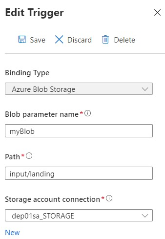
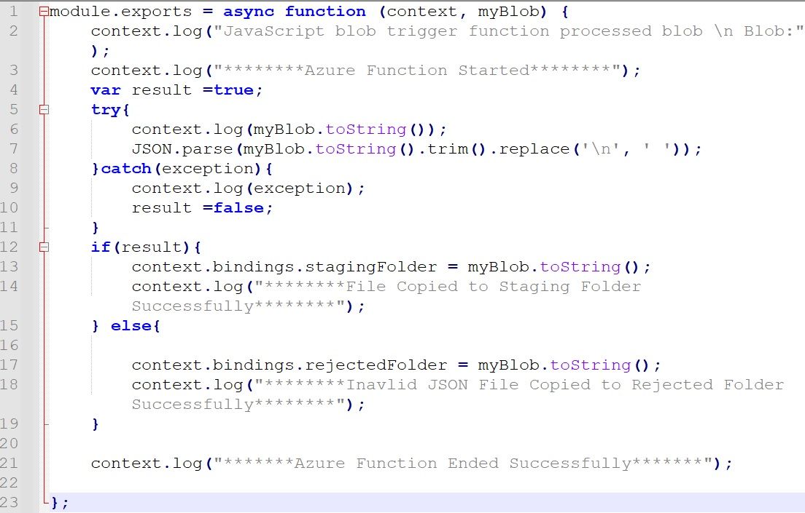
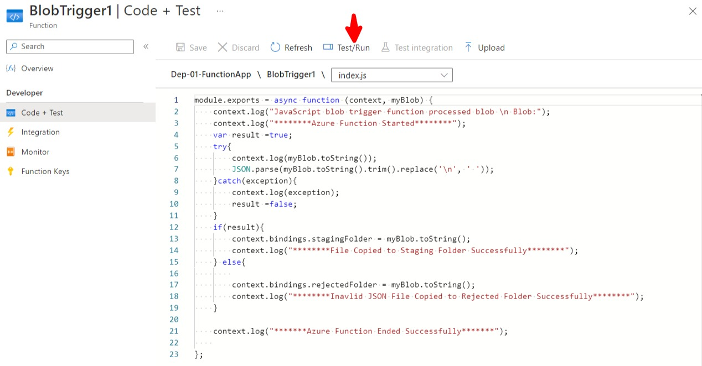

# Create Azure Function with Blob Storage Trigger

Welcome to this lab where we will create Azure Function with Blob Storage Trigger.

Now that the data is pulled into our landing folder in ADLS by virtue or running ADF pipkline on a daily basis, we have our data available to be processed for the next stage.

In this lab, we will create an Azure function, that will get triggered when a file is uploaded into Landing folder in ADLS. This Azure function will validate the JSON, checking if JSON is valid or not. Azure function will then move this JSON file to either Rejected or Staging folder.

So let's move to the Azure portal and create our Azure function.

* In Azure Portal, search for Function App. Click on Function App in search results

* Click on "Create Function App" button to create a new function app
* Select you subscription 
* Select the existing Resource group that we created earlier
* Provide a unique function name
* For Publishing option, keep the default radio button code as selected
* For runtime stack, use Node.js
* For Version, select the most recent version available
* Select your appropriate region for this function app

* For Operating system, select Windows
* For Plan type, select Serverless
* Click on "Review + Create" button

* Click on Create button to create the function app

* When the deployment is complete, click on "Go To Resource" button

* Click on Functions in left hand menu, then click Create to create a new function.

* Select Azure Blob storage trigger from the list of Templates and click Create button

* Click on new and select a new storage account connection
* Click on Create button

* On the integration page, click on Azure Blob STorage Trigger

* On the Edit Trigger pane, provide input/landing as the path because in our ADLS, we have a Landing folder inside input container where files will be dropped

Click on Save.

* We will create two outputs - validated JSON file will be moved to staging folder and invalid JSON file will be moved to rejected folder
* Click on Outputs in Integration page
* Click on Add output
* For Blob parameter name, provide stagingFolder
* For Path, provide input/staging/{rand-guid}.json
* Click on OK button.

* Let's create the other outputs now
* Click on Outputs in Integration page
* Click on Add output
* For Blob parameter name, provide rejectedFolder
* For Path, provide input/rejected/{rand-guid}.json
* Click on OK button

* This is the code that can be found in the resources folder of this lab
* We are using JSON.Parse() method to check if the file content is valid JSON
* Depending on the result of validation, we move the file to either staging or rejected folder

* Click on "Code + Test" in the left hand navigation 

* Copy paste the code from resource folder and overwrite it on index.js
* Click on Save

* Let us upload a file into our blob storage
* A sample upload file can be found in Resource folder for this lab
* Ensure that you upload the file in the correct date folder when testing this function

* Click on Test/Run to run Azure function

* For the input parameter, provide the path to the uploaded file
* Click on Run button

* Check the logs. You will see message that file was copied to Staging Folder successfully

* Go to ADLS blob storage and check if the input file appears in staging folder

That's the end of this lab. 

[Back](../Lab-05/readme.md)  [Next](../Lab-07/readme.md)