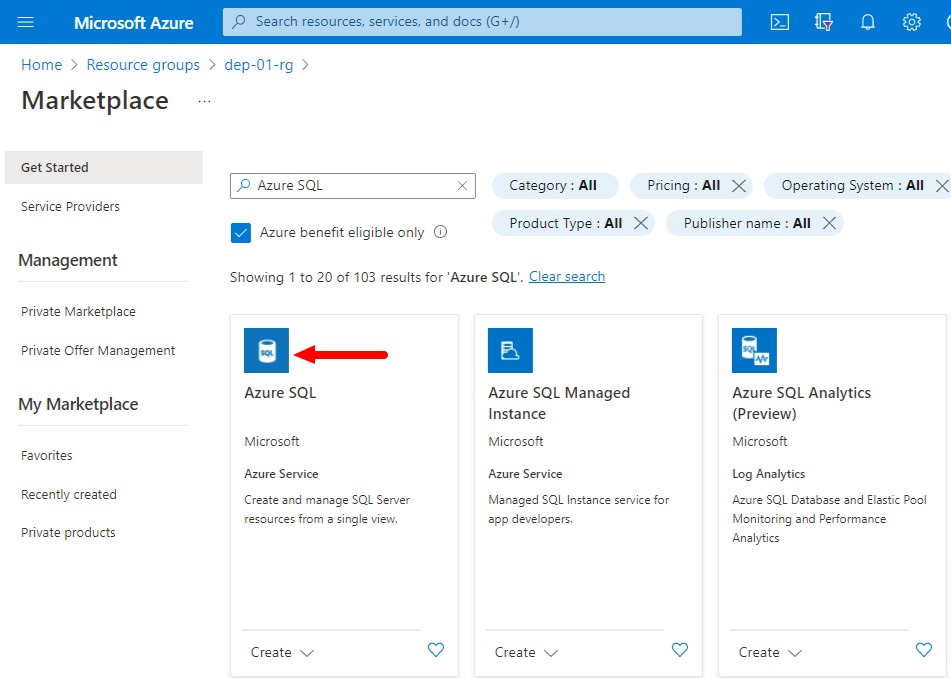
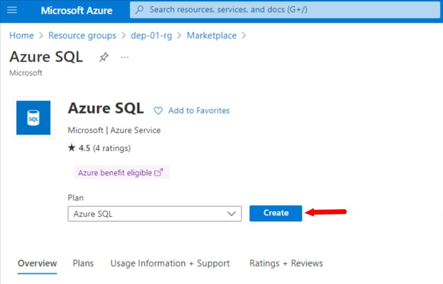
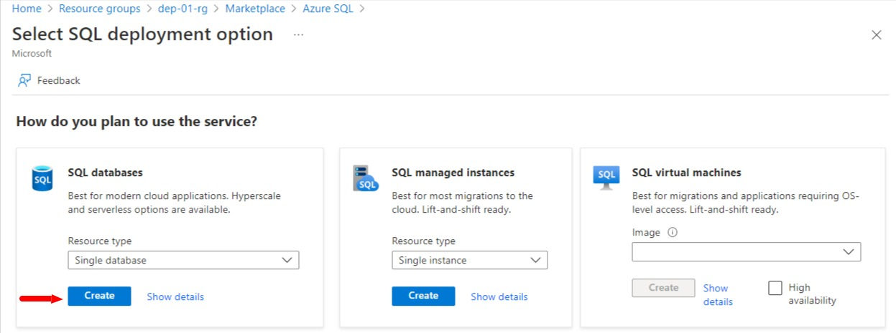
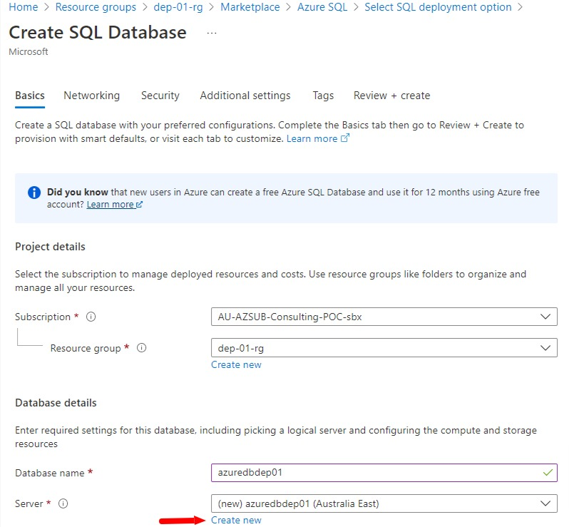
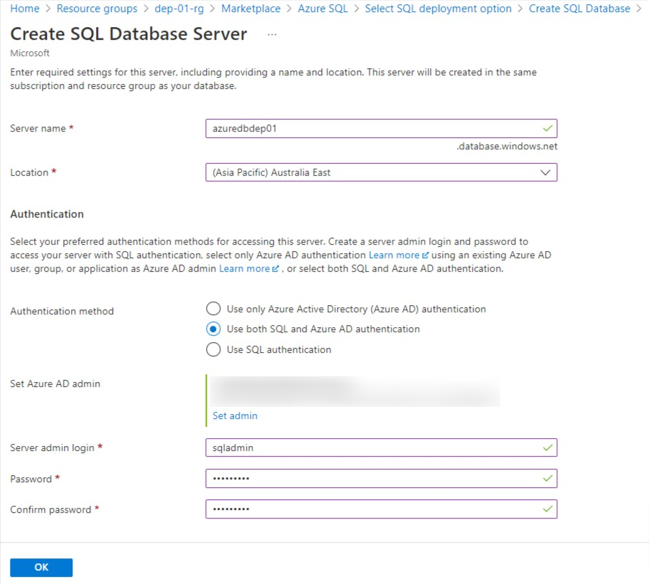
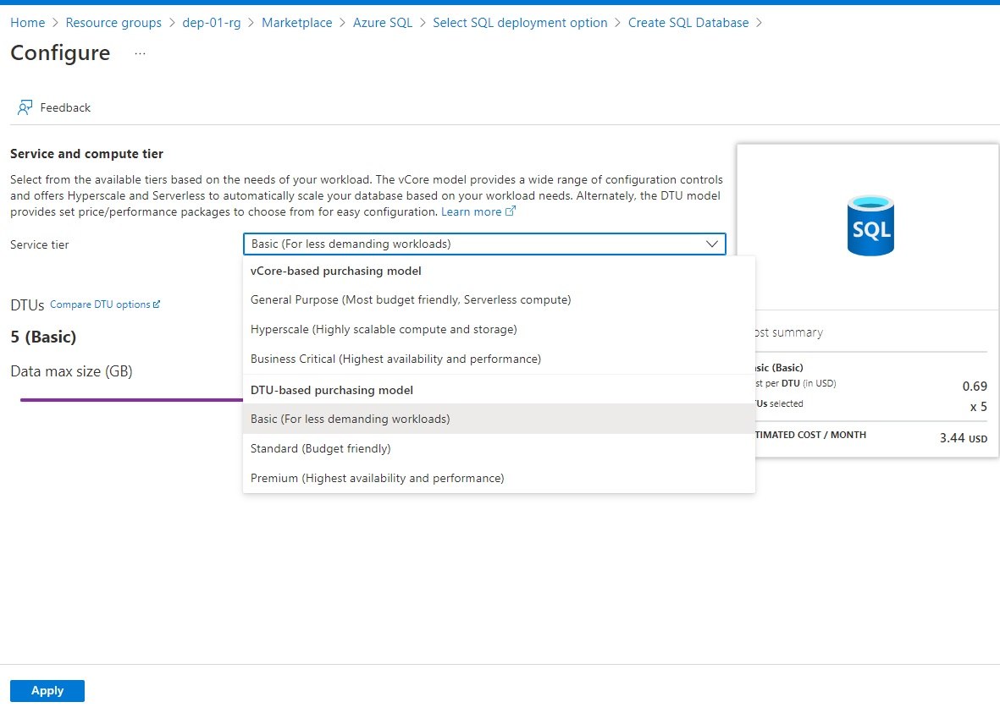
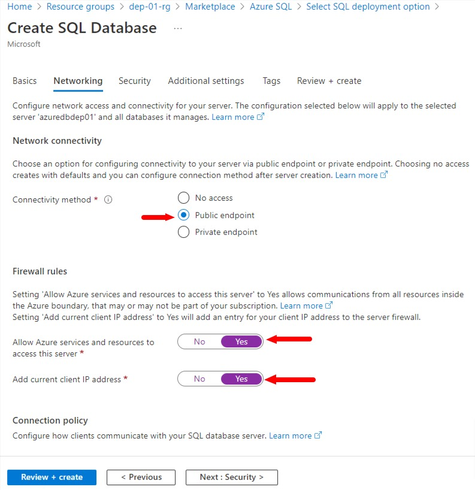
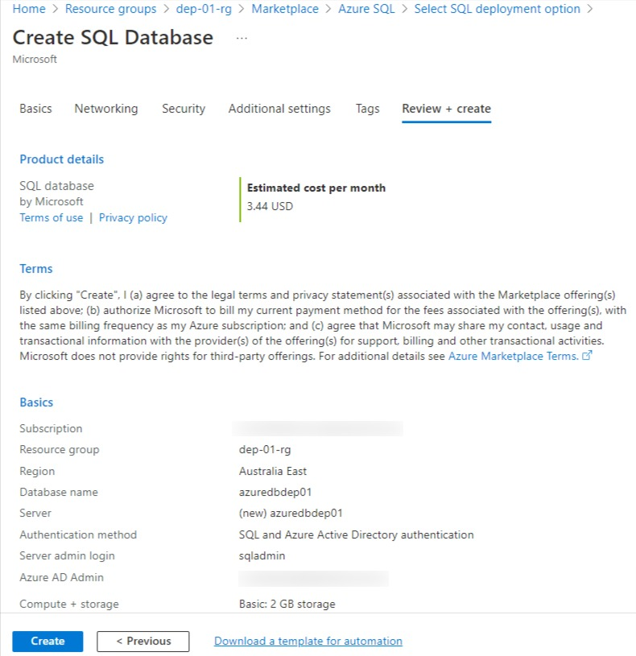
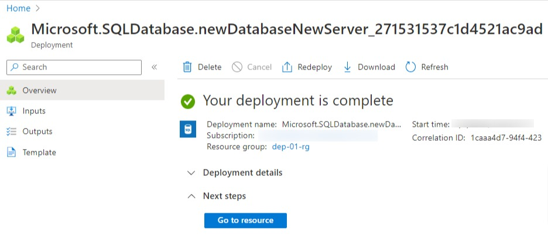

# Create Azure SQL 

Welcome to this lab where we will create Azure SQL database. This validated JSON data will be stored here.

Let's move to the Azure portal and create our Azure SQL database.

* In Azure Portal, search for Azure SQL
* Click on "Create Azure SQL" in search results to create a new Azure SQL service
    

* Select "Azure SQL" as Plan and click Create button

* Select "Single Database" for resource type, and click Create button

*  On the Create SQL Database page, select/provide the following values:
    * Select you subscription 
    * Select the existing Resource group that we created earlier
    * Provide a unique database name
    * Click on "Create New" link to create a new database server

*  On the Create SQL Database Server page, select/provide the following values:
    * Provide a unique database server name
    * Select your location
    * For Authentication, select "Use both SQL and Azure AD authentication", although you can select any from the given choices for this lab
    * Provide a server admin login
    * Provide a strong password (and note it down some place safe)
    * Confirm the same password
    * Click "OK" button

* For service and compute tier, select/provide the following values:
    * Select Basic DTU model 
    * Click on "Apply" button

*  On the Networking tab, select/provide the following values:
    * Select "Public endpoint" for Connectivity method
    * Select "Yes" for "Allow Azure servuces and resources to access this server" in Firewall rules
    * Select "Yes" for "Add current client IP address" in Firewall rules
    * Click and "Next : Secutiry" button.
    * Keep default settings for all other tabs until you finally reach "Review + create" tab 

* Double check all information shown on "Review + create" tab and click on "Create" button.

* Wait until the resource deployment is complete. 

That's the end of this lab. 

[Back](../Lab-08/readme.md)  [Next](../Lab-06/readme.md)