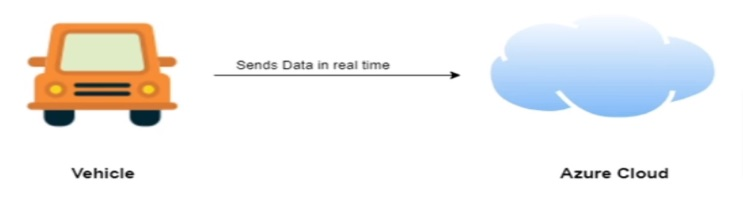
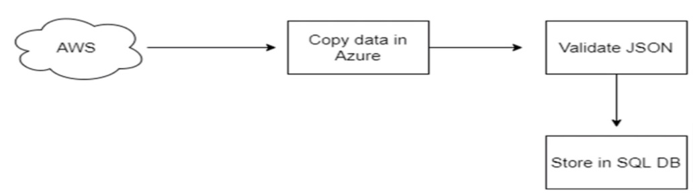
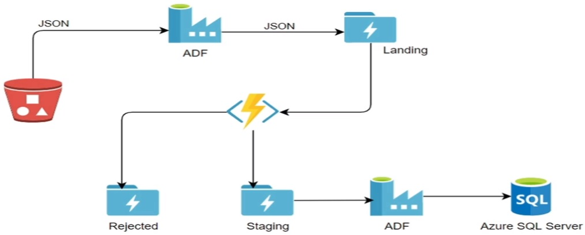

# Connected Vehicle Project

Hello and welcome to the connected vehicle project.

## Project Overview

General Motors is one of the leading heavy vehicle manufacturing company. To improve their services, they are planning to rollout new features based on IOT.

General Motors have a tie up with a third party who provide a device that General Motors plugs in into their cars and other vehicles.This device has the capability to capture the vehicle temperature, speed, turbulence and a few more parameters. All these parameter are captured by this device and this telemetry data is sent to the AWS cloud by this third party device and stored in JSON file format.

## The Task 
The Data Engineering team at General Motors have the following tasks to do:

* Move the telemetry data stored as JSON files in AWS cloud to Microsoft Azure storage
* Validate the JSON data
* Store validated data in SQL database for use by Data Science team

## The Goal

The goal is to develop a Data Engineering Project for a connected vehicle use case from scratch and include all phases of development - designing, architecting, implementing and testing.

## Architecture Diagram

* Every architecture diagram has to start with an input source, and it has to end with the output source. So you can see that our input source is AWS Cloud S3 storage bucket. So this is the storage bucket where all the telemetry data in JSON file format will be saved by the IoT devices.

* Once the data is moved, the industry standard says the data must go into the landing folder. The landing folder always contains the original, raw, unprocessed data coming from source.

* We then validate the JSON data using an Azure function. We have a storage based trigger on the Azure function.As soon as a file arrives into the landing folder, this azure function will trigger automatically. This Azure function will read the file and validate whether data is stored in proper JSON format or not. If it contains a proper JSON, we move the data into the staging folder, else into Rejected folder. 

## Technologies involved

We'll use a range of technologies:

* Azure Data Lake Storage Gen 2
* Azure Data Factory
* Data Factory Pipeline
* Azure Functions
* Azure Key Vault
* Azure SQL DB
* SSMS
* AWS S3 Bucket
* Connect ADF to Databricks
* Connect Databricks to SQL Server
* Connect Databricks to ADLS
* Connect S3 to Azure Cloud
* Triggers
* SAS token
* Create Secrets scope in Databricks
* Store secretes in Key Vault and access them

Click [here](Lab-01/readme.md) to start with the implementation.

 